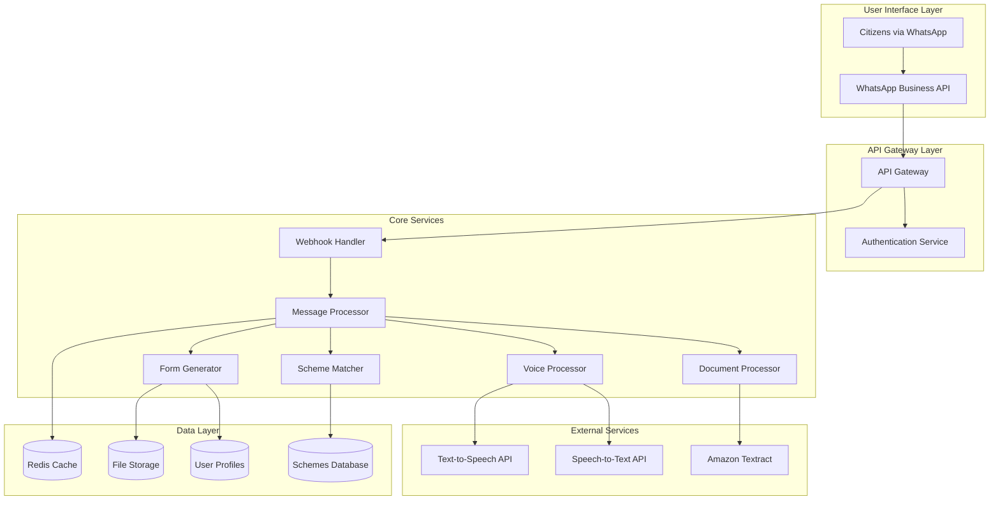
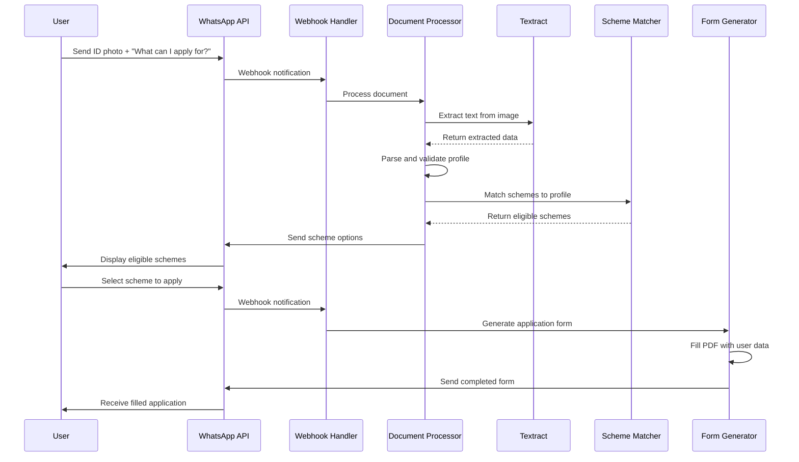

# Design Document: Mitra AI Multi-Modal Welfare Agent

## Overview

Mitra AI is a cloud-native, event-driven system that transforms government welfare scheme access from information discovery to execution-ready applications. The system integrates WhatsApp Business API for user interaction, Amazon Textract for document processing, and automated PDF form generation to create a seamless experience for citizens with varying digital literacy levels.

The architecture follows a microservices pattern with event-driven communication, enabling scalability and maintainability within hackathon constraints while supporting production-ready deployment patterns.

## Architecture

### High-Level Architecture



### Event Flow Architecture



## Components and Interfaces

### 1. Webhook Handler Service

**Responsibility**: Receives and routes WhatsApp webhook events to appropriate processors.

**Key Methods**:
```python
class WebhookHandler:
    def handle_message(self, webhook_data: dict) -> None
    def handle_status_update(self, webhook_data: dict) -> None
    def verify_webhook(self, token: str) -> bool
    def route_to_processor(self, message_type: str, data: dict) -> None
```

**Interfaces**:
- **Input**: WhatsApp webhook POST requests (JSON)
- **Output**: Routed events to message processors
- **Dependencies**: Message Processor, Authentication Service

### 2. Document Processor Service

**Responsibility**: Extracts and validates demographic information from ID documents.

**Key Methods**:
```python
class DocumentProcessor:
    def extract_text(self, image_data: bytes) -> TextractResponse
    def parse_id_card(self, extracted_text: dict) -> UserProfile
    def validate_profile(self, profile: UserProfile) -> ValidationResult
    def handle_aadhaar(self, text: dict) -> UserProfile
    def handle_voter_id(self, text: dict) -> UserProfile
    def handle_ration_card(self, text: dict) -> UserProfile
```

**Data Models**:
```python
@dataclass
class UserProfile:
    name: str
    age: int
    gender: str
    address: Address
    occupation: Optional[str]
    income_category: Optional[str]
    family_size: Optional[int]
    document_type: str
    extracted_fields: dict

@dataclass
class Address:
    state: str
    district: str
    block: Optional[str]
    village: Optional[str]
    pincode: str
```

### 3. Voice Processor Service

**Responsibility**: Handles speech-to-text and text-to-speech conversion with multi-language support.

**Key Methods**:
```python
class VoiceProcessor:
    def speech_to_text(self, audio_data: bytes, language: str) -> TranscriptionResult
    def text_to_speech(self, text: str, language: str) -> bytes
    def detect_language(self, audio_data: bytes) -> str
    def handle_low_confidence(self, result: TranscriptionResult) -> str
```

### 4. Scheme Matcher Service

**Responsibility**: Matches user profiles to eligible government schemes using rule-based algorithms.

**Key Methods**:
```python
class SchemeMatcher:
    def find_eligible_schemes(self, profile: UserProfile) -> List[SchemeMatch]
    def rank_schemes(self, matches: List[SchemeMatch]) -> List[SchemeMatch]
    def check_eligibility(self, scheme: Scheme, profile: UserProfile) -> bool
    def filter_by_deadline(self, schemes: List[Scheme]) -> List[Scheme]
```

**Data Models**:
```python
@dataclass
class Scheme:
    id: str
    name: str
    description: str
    eligibility_criteria: dict
    application_deadline: Optional[datetime]
    required_documents: List[str]
    form_template: str
    implementing_agency: str

@dataclass
class SchemeMatch:
    scheme: Scheme
    confidence_score: float
    missing_criteria: List[str]
    priority_rank: int
```

### 5. Form Generator Service

**Responsibility**: Creates pre-filled PDF application forms using user profile data.

**Key Methods**:
```python
class FormGenerator:
    def generate_form(self, scheme_id: str, profile: UserProfile) -> PDFResult
    def map_profile_to_form(self, profile: UserProfile, template: FormTemplate) -> dict
    def fill_pdf_fields(self, template_path: str, field_data: dict) -> bytes
    def validate_required_fields(self, form_data: dict, template: FormTemplate) -> ValidationResult
    def generate_submission_instructions(self, scheme: Scheme, profile: UserProfile) -> str
```

**Dependencies**:
- **fillpdf** library for PDF form manipulation
- **PyPDF2** for PDF processing
- Form templates stored in cloud storage

### 6. Message Processor Service

**Responsibility**: Orchestrates conversation flow and maintains context across interactions.

**Key Methods**:
```python
class MessageProcessor:
    def process_text_message(self, message: TextMessage) -> Response
    def process_voice_message(self, message: VoiceMessage) -> Response
    def process_image_message(self, message: ImageMessage) -> Response
    def maintain_conversation_context(self, user_id: str, message: Message) -> ConversationState
    def generate_response(self, intent: str, context: ConversationState) -> Response
```

## Data Models

### Core Data Structures

```python
@dataclass
class ConversationState:
    user_id: str
    current_step: str
    user_profile: Optional[UserProfile]
    selected_schemes: List[str]
    language_preference: str
    last_interaction: datetime
    context_data: dict

@dataclass
class Message:
    id: str
    user_id: str
    message_type: str  # text, voice, image
    content: Union[str, bytes]
    timestamp: datetime
    language: Optional[str]

@dataclass
class Response:
    message_type: str  # text, voice, document
    content: Union[str, bytes]
    language: str
    attachments: Optional[List[Attachment]]
    quick_replies: Optional[List[str]]
```

### Database Schema

**Schemes Collection**:
```json
{
  "scheme_id": "pm_kisan_2024",
  "name": "PM-KISAN Samman Nidhi",
  "description": "Income support for farmer families",
  "eligibility_criteria": {
    "occupation": ["farmer", "agricultural_worker"],
    "land_holding": {"max": 2.0, "unit": "hectares"},
    "age": {"min": 18, "max": null},
    "income": {"max": 200000, "currency": "INR"}
  },
  "required_documents": ["aadhaar", "land_records", "bank_passbook"],
  "application_deadline": "2024-12-31T23:59:59Z",
  "form_template": "pm_kisan_application.pdf",
  "implementing_agency": "Ministry of Agriculture"
}
```

**User Profiles Collection**:
```json
{
  "user_id": "whatsapp_91xxxxxxxxxx",
  "profile": {
    "name": "राम कुमार",
    "age": 35,
    "gender": "male",
    "address": {
      "state": "Uttar Pradesh",
      "district": "Varanasi",
      "block": "Cholapur",
      "village": "Rampur",
      "pincode": "221106"
    },
    "occupation": "farmer",
    "income_category": "bpl"
  },
  "conversation_state": {
    "language_preference": "hindi",
    "last_interaction": "2024-01-15T10:30:00Z"
  },
  "created_at": "2024-01-15T10:00:00Z",
  "updated_at": "2024-01-15T10:30:00Z"
}
```
## Correctness Properties

*A property is a characteristic or behavior that should hold true across all valid executions of a system—essentially, a formal statement about what the system should do. Properties serve as the bridge between human-readable specifications and machine-verifiable correctness guarantees.*

Now I'll analyze the acceptance criteria from the requirements to determine which can be tested as properties:

### Property Reflection

After analyzing all acceptance criteria, I've identified several areas where properties can be consolidated:

**Document Processing Consolidation**:
- Properties 1.3, 1.4, 1.5 (specific ID card types) can be combined into one comprehensive property about document type handling
- Properties 1.1, 1.6, 1.7 can be combined into a comprehensive extraction and validation property

**Language Processing Consolidation**:
- Properties 6.1, 6.2, 6.4, 6.5 can be combined into one comprehensive language consistency property
- Properties 6.3, 6.7 can be combined into one fallback behavior property

**Security and Privacy Consolidation**:
- Properties 7.1, 7.3, 7.6 can be combined into one comprehensive data security property
- Properties 7.2, 7.5 can be combined into one data lifecycle management property

**Performance Consolidation**:
- Properties 5.2, 8.1, 8.4 can be combined into one comprehensive performance property
- Properties 8.2, 8.6 can be combined into one graceful degradation property

### Correctness Properties

**Property 1: Document Processing Round Trip**
*For any* valid ID document (Aadhaar, Voter ID, or Ration Card), processing the document should extract all required demographic fields and store them in a structured format that can be successfully used for scheme matching
**Validates: Requirements 1.1, 1.3, 1.4, 1.5, 1.6, 1.7**

**Property 2: Incomplete Data Handling**
*For any* document processing result with missing or unclear information, the system should request clarification and not proceed with incomplete profiles
**Validates: Requirements 1.2**

**Property 3: Voice Processing Round Trip**
*For any* supported language (Hindi/English), converting speech to text and then text back to speech should preserve the semantic meaning of the original message
**Validates: Requirements 2.1, 2.2**

**Property 4: Voice Confidence Thresholds**
*For any* voice message with recognition confidence below 80%, the system should request repetition rather than proceeding with uncertain transcription
**Validates: Requirements 2.3**

**Property 5: Language Fallback Consistency**
*For any* unsupported regional language input, the system should gracefully fallback to Hindi or English and maintain conversation continuity
**Validates: Requirements 2.5, 6.3, 6.7**

**Property 6: Conversation Context Preservation**
*For any* multi-turn conversation, the system should maintain user context and conversation state across all voice and text interactions
**Validates: Requirements 2.6, 5.3**

**Property 7: Scheme Matching Completeness**
*For any* valid user profile, the scheme matcher should search all available schemes and return matches ranked by relevance and deadline proximity
**Validates: Requirements 3.1, 3.2, 3.4**

**Property 8: Expired Scheme Exclusion**
*For any* scheme search result, all returned schemes should have valid application deadlines and open application windows
**Validates: Requirements 3.6**

**Property 9: No-Match Fallback**
*For any* user profile with no exact scheme matches, the system should suggest the closest alternatives and explain eligibility gaps
**Validates: Requirements 3.7**

**Property 10: Form Generation Completeness**
*For any* scheme selection and user profile, the form generator should create a PDF with all available profile data mapped to corresponding form fields
**Validates: Requirements 4.1, 4.2**

**Property 11: Missing Data Identification**
*For any* form generation request, if required information is missing from the user profile, the system should identify and request the specific missing data before generating the form
**Validates: Requirements 4.3**

**Property 12: Form Validation Completeness**
*For any* generated form, all mandatory fields should be validated as complete before PDF generation, and submission instructions should be included
**Validates: Requirements 4.6, 4.7**

**Property 13: Document Checklist Generation**
*For any* scheme requiring attachments, the system should provide a complete checklist of required documents
**Validates: Requirements 4.5**

**Property 14: Message Type Handling**
*For any* supported message type (text, voice, image), the WhatsApp interface should process and respond appropriately within performance thresholds
**Validates: Requirements 5.1, 5.2**

**Property 15: Concurrent User Isolation**
*For any* set of concurrent user conversations, each user's data and conversation state should remain isolated without cross-contamination
**Validates: Requirements 5.5**

**Property 16: Error Message Localization**
*For any* system error, the error message should be provided in the user's preferred language and be user-friendly
**Validates: Requirements 5.6**

**Property 17: Language Consistency**
*For any* user interaction, if the user communicates in a supported language, all system responses should be in that same language
**Validates: Requirements 6.1, 6.2, 6.4, 6.5**

**Property 18: Code-Mixed Language Handling**
*For any* Hindi-English code-mixed input, the system should understand the intent and respond appropriately
**Validates: Requirements 6.6**

**Property 19: Data Security Round Trip**
*For any* personal data processed by the system, the data should be encrypted at rest and in transit, with all access events logged for audit
**Validates: Requirements 7.1, 7.3, 7.6**

**Property 20: Data Lifecycle Management**
*For any* uploaded document or user data, the system should enforce retention policies (24-hour image deletion) and honor deletion requests within 48 hours
**Validates: Requirements 7.2, 7.5**

**Property 21: Privacy Protection**
*For any* user data, the system should not share information with third parties without explicit consent and should notify users of any data breaches within 72 hours
**Validates: Requirements 7.4, 7.7**

**Property 22: Performance Under Load**
*For any* system operation, performance thresholds should be met (document processing within 60 seconds, message responses within 10 seconds) even under high load with appropriate queuing
**Validates: Requirements 8.1, 8.4**

**Property 23: Graceful Degradation**
*For any* external service failure or poor network conditions, the system should provide fallback functionality and compressed responses to maintain service availability
**Validates: Requirements 8.2, 8.6**

**Property 24: Caching Consistency**
*For any* frequently accessed scheme information, the cached data should be consistent with the source database and improve response times
**Validates: Requirements 8.5**

**Property 25: Concurrent User Capacity**
*For any* peak usage period, the system should handle up to 1000 concurrent users without service degradation
**Validates: Requirements 8.7**

## Error Handling

### Error Categories and Responses

**Document Processing Errors**:
- **Invalid Image Format**: Request user to send clear photo of ID card
- **OCR Extraction Failure**: Ask user to retake photo with better lighting
- **Incomplete Information**: Request specific missing details (e.g., "I couldn't read your address clearly, can you tell me your district?")

**Voice Processing Errors**:
- **Low Confidence Recognition**: "I didn't understand clearly, please repeat your message"
- **Unsupported Language**: "I can help you in Hindi or English, which would you prefer?"
- **Audio Quality Issues**: "The audio is unclear, please try sending a voice message again"

**Scheme Matching Errors**:
- **No Eligible Schemes**: Provide closest alternatives and explain eligibility gaps
- **Database Unavailable**: "Scheme information is temporarily unavailable, please try again in a few minutes"
- **Profile Incomplete**: Request missing demographic information needed for matching

**Form Generation Errors**:
- **Missing Required Data**: Highlight specific fields and request information
- **Template Not Found**: Inform user that application form is being updated
- **PDF Generation Failure**: Offer alternative formats or manual form download

**System-Level Errors**:
- **External Service Failures**: Graceful degradation with reduced functionality
- **High Load Conditions**: Queue management with estimated wait times
- **Network Issues**: Compressed responses and text-only fallbacks

### Error Recovery Strategies

**Retry Mechanisms**:
- Automatic retry for transient failures (network timeouts, service unavailability)
- Exponential backoff for external API calls
- Circuit breaker pattern for external service protection

**Fallback Strategies**:
- Text-only responses when multimedia processing fails
- Manual form templates when automated generation fails
- Cached responses when real-time data is unavailable

**User Communication**:
- Clear, actionable error messages in user's preferred language
- Progress updates for long-running operations
- Alternative options when primary functionality is unavailable

## Testing Strategy

### Dual Testing Approach

The testing strategy employs both unit tests and property-based tests to ensure comprehensive coverage:

**Unit Tests** focus on:
- Specific examples of document processing (sample Aadhaar, Voter ID formats)
- Integration points between services (WhatsApp webhook handling)
- Edge cases and error conditions (malformed documents, network failures)
- Specific scheme matching scenarios (PM-Kisan eligibility, scholarship criteria)

**Property-Based Tests** focus on:
- Universal properties that hold for all inputs (document processing round trips)
- Comprehensive input coverage through randomization (various ID card formats)
- Language consistency across all supported languages
- Security and privacy properties across all data operations

### Property-Based Testing Configuration

**Testing Framework**: Use **Hypothesis** for Python-based property testing
- Minimum 100 iterations per property test to ensure statistical confidence
- Each property test references its corresponding design document property
- Tag format: **Feature: mitra-ai, Property {number}: {property_text}**

**Test Data Generation**:
- Generate synthetic ID card data with various formats and completeness levels
- Create voice message samples in different languages and quality levels
- Generate user profiles with diverse demographic combinations
- Create scheme databases with various eligibility criteria patterns

**Performance Testing**:
- Load testing with up to 1000 concurrent users
- Document processing performance with various image sizes and qualities
- Response time validation under different network conditions
- Memory usage monitoring during peak operations

**Security Testing**:
- Data encryption validation for all stored and transmitted data
- Privacy compliance testing for data retention and deletion
- Audit log completeness verification
- Third-party data sharing prevention validation

### Integration Testing

**External Service Integration**:
- WhatsApp Business API webhook handling and message sending
- Amazon Textract OCR processing with various document types
- Speech-to-text and text-to-speech API integration
- Database operations and caching layer functionality

**End-to-End Workflows**:
- Complete user journey from document upload to form generation
- Multi-language conversation flows
- Error recovery and fallback scenarios
- Concurrent user interaction isolation

**Hackathon-Specific Testing**:
- Rapid deployment and configuration validation
- Core functionality demonstration scenarios
- Performance under demo conditions
- Fallback to manual processes when needed